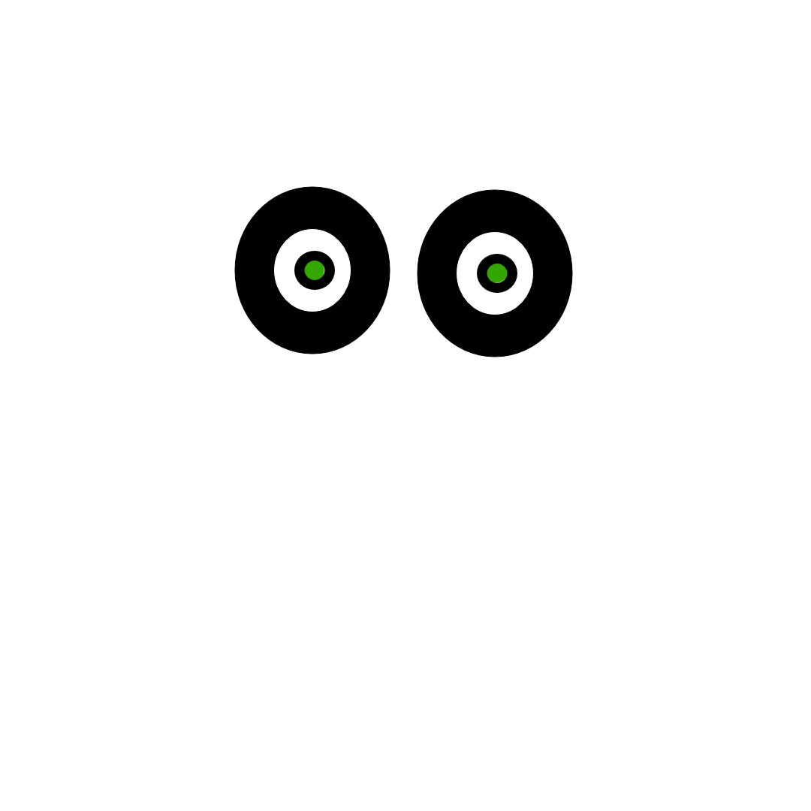
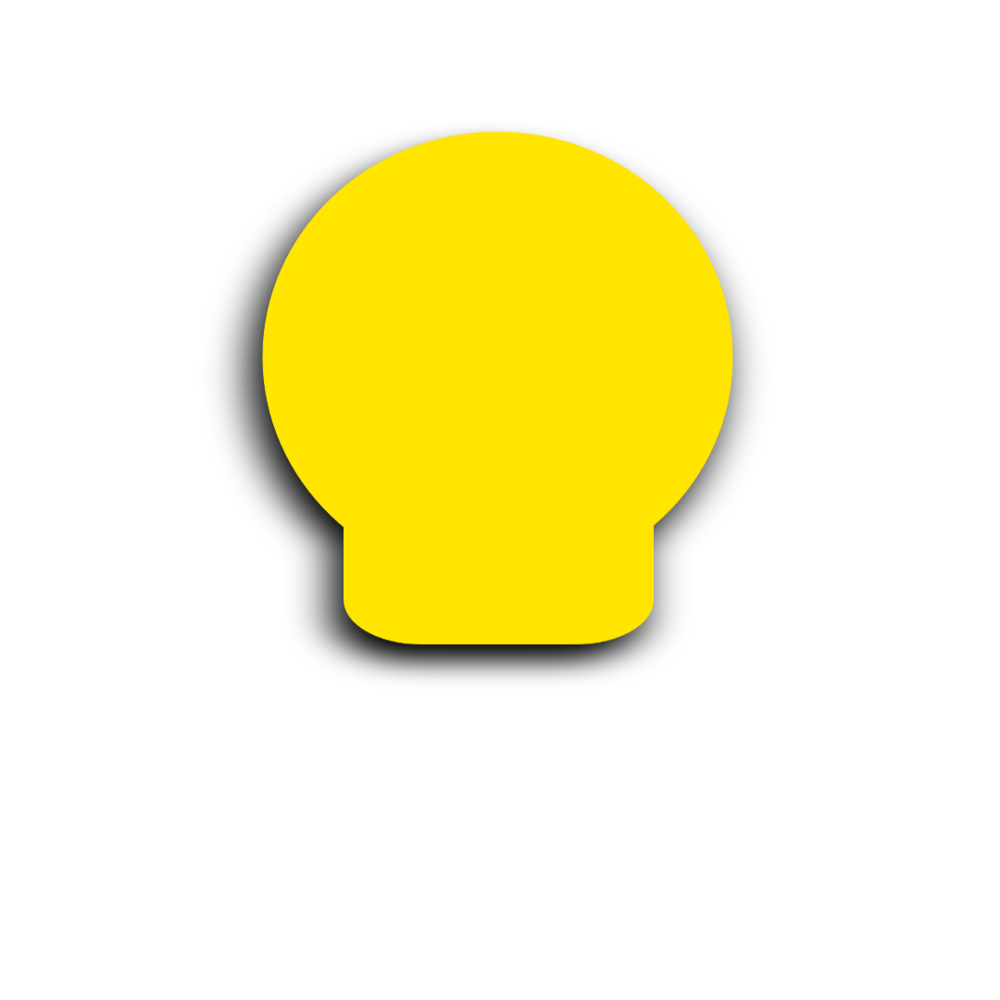

this project will take layers and smoosh them into as many images as you want.

you give the program a bunch of layers that look like this:

and it smooshes them together until you get a single image. it does this as many times as you want:

current state: makes pretty pictures. has nothing to do with blockchains yet.

updates:

program now makes paths by looking into the nft folder and finding all the files.
now all images are verified as unique
you can now add weights to increase or decrease the rarity of attributes.

needs updates:
still need to calculate the rarity of attributes
still need to generate metadata in json format
need a way to handle infinite loop by asking for more unique images than possible with the given attributes.

if you want to try this yourself...
clone the repo:

the __main__.py file calls the make_images() function. it takes in the number of images you want to make. and stores them in the results folder.

this is a work in progress. once I feel like this program is complete, I will add instructions on how to add your own layers and generate your own images.
